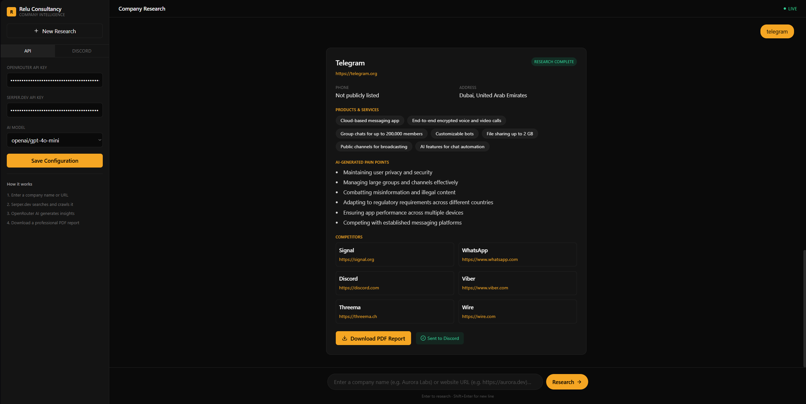
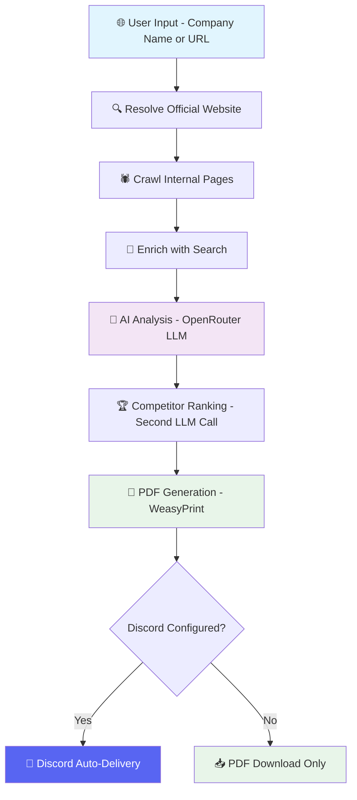
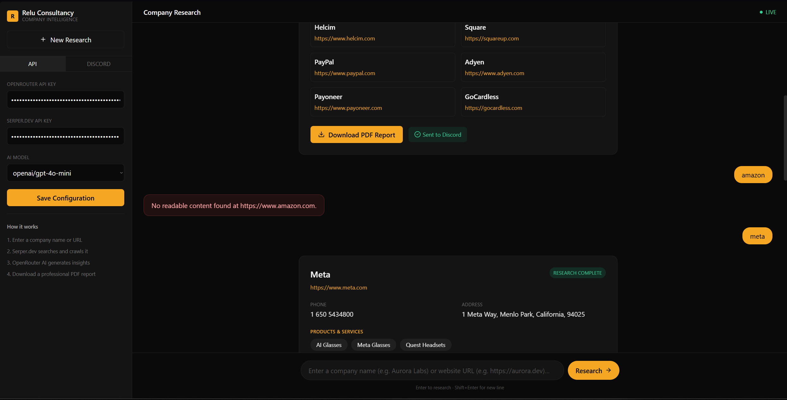

<div align="center">

# 🔍 Relu Company Research Assistant

<p>
<a href="https://fastapi.tiangolo.com/"></a>
<a href="https://nextjs.org/"></a>
<a href="https://openrouter.ai/"></a>
<a href="https://serper.dev/"></a>
<a href="https://weasyprint.org/"></a>
<a href="https://discord.com/"></a>

</p>

<br/>


> **Drop in a company name or URL. Get a full AI research report — in seconds.**  
> Crawls the web · Enriches with search · Analyzes with AI · Exports to PDF · Delivers via Discord.

<br/>

🌐 **Live App:** [relu-frontend-gamma.vercel.app](https://relu-frontend-gamma.vercel.app)

<br/>

[](https://relu-frontend-gamma.vercel.app)
[](https://github.com/AIstar007/Relu-company-research-assistant.)
[](https://github.com/AIstar007/Relu-company-research-assistant./issues)

[🚀 Quick Start](#-quick-start) · [🏗️ Architecture](#️-architecture) · [🔄 Request Flow](#-request-flow) · [⚙️ Configuration](#️-configuration) · [🚢 Deployment](#-deployment) · [🎨 Design Choices](#-design-choices)

</div>

---

## 📸 Live Demo

<div align="center">

### 💬 Main Interface


### 📊 Research Result View


</div>

<table>
<tr>
<td width="50%" align="center">

**📄 Generated PDF Report**



</td>
<td width="50%" align="center">

**💬 Discord Auto-Delivery**


</td>
</tr>
</table>

---

## ✨ What It Does

Give it **any company name or website URL** and it runs a full 7-step intelligence pipeline:

| Step | Service | Action |
|---|---|---|
| 🌐 **1. Resolve** | Serper.dev | Finds the official website URL — filters LinkedIn, Wikipedia, aggregators |
| 🕷️ **2. Crawl** | httpx + BS4 | Scores internal links by keyword relevance, fetches concurrently, strips boilerplate |
| 🔎 **3. Enrich** | Serper.dev | Secondary search pass for phone, address, contact hints not always on-site |
| 🤖 **4. Analyze** | OpenRouter LLM | JSON-only prompt → company summary, products/services, pain points, industry label |
| 🏆 **5. Rank Competitors** | OpenRouter LLM | Second LLM call deduplicates and ranks competitor candidates into a clean list |
| 📄 **6. Export PDF** | WeasyPrint | Renders a professionally styled, downloadable report from HTML/CSS |
| 💬 **7. Deliver** | Discord Bot API | (Optional) Sends PDF + applicant info to your configured Discord channel |

All through a **dark, ChatGPT-style chat interface** — no database, no auth, zero persisted state.

---

## 🏗️ Architecture

```
relu-research-assistant/
│
├── 📁 backend/                       FastAPI service
│   ├── main.py
│   ├── config.py
│   ├── models/
│   │   └── schemas.py
│   ├── services/
│   │   ├── search.py                 Serper.dev — website resolution, competitors, contacts
│   │   ├── crawler.py                Site discovery + crawling + content extraction
│   │   ├── ai_engine.py              OpenRouter — structured analysis + competitor ranking
│   │   ├── pdf_generator.py          WeasyPrint HTML → PDF report builder
│   │   └── discord_bot.py            Discord Bot API — report + applicant delivery
│   └── routers/
│       ├── research.py               POST /api/research — full orchestration pipeline
│       └── discord.py                POST /api/discord/test — validate bot/channel
│
├── 📁 frontend/                      Next.js 14 (App Router) + Tailwind
│   ├── app/page.tsx                  Chat interface, examples, progress states
│   ├── components/Sidebar.tsx        API keys + Discord config tabs
│   ├── components/ResearchCard.tsx   Rendered result + PDF download button
│   └── lib/api.ts                    Backend client
│
└── 📁 screenshots/                   Demo images used in this README
```

---

## 🔄 Request Flow



### Step-by-Step Breakdown

```
User Input (company name or URL)
        │
        ▼
┌────────────────────┐
│  1. RESOLVE        │  Serper.dev → find official website URL
│  (if not a URL)    │  Block: Wikipedia, LinkedIn, aggregator domains
└────────┬───────────┘
         │
         ▼
┌────────────────────┐
│  2. CRAWL          │  Fetch homepage → discover + score internal links
│                    │  Keywords: about / products / services / pricing
│                    │  Top 8 pages fetched concurrently → strip boilerplate
└────────┬───────────┘
         │
         ▼
┌────────────────────┐
│  3. ENRICH         │  Secondary Serper pass → phone, address, contact hints
└────────┬───────────┘
         │
         ▼
┌────────────────────┐
│  4. ANALYZE        │  Crawled text → OpenRouter (user-chosen model)
│                    │  JSON-only prompt → summary, products, pain points, industry
└────────┬───────────┘
         │
         ▼
┌────────────────────┐
│  5. COMPETITORS    │  Serper finds candidates
│                    │  Second LLM call dedupes + ranks → name + website list
└────────┬───────────┘
         │
         ▼
┌────────────────────┐
│  6. PDF            │  WeasyPrint renders HTML/CSS → base64 PDF returned
└────────┬───────────┘
         │
         ▼
┌────────────────────┐
│  7. DISCORD        │  (Optional) PDF + applicant info → Discord Bot API
│  (if configured)   │
└────────────────────┘
```

---

## 🚀 Quick Start

### Backend

```bash
cd backend

python -m venv venv
source venv/bin/activate          # macOS / Linux
# venv\Scripts\activate           # Windows

pip install -r requirements.txt
uvicorn main:app --reload --port 8000
```

> **WeasyPrint system dependencies** (required for PDF generation):
>
> ```bash
> # macOS
> brew install pango gdk-pixbuf libffi
>
> # Ubuntu / Debian
> apt-get install libpango-1.0-0 libpangocairo-1.0-0 libgdk-pixbuf-2.0-0 libffi-dev libcairo2
> ```
>
> 🐳 **Using Docker?** The included `Dockerfile` handles all system dependencies automatically.
>
> ⚠️ **pydyf version pin:** `requirements.txt` pins `pydyf==0.10.0` alongside `weasyprint==62.3`. Newer `pydyf` releases (0.11+) removed an internal method WeasyPrint 62.3 depends on — upgrading breaks PDF generation with an `AttributeError`. Keep this pin unless you also upgrade WeasyPrint.

### Frontend

```bash
cd frontend
npm install
cp .env.example .env.local        # Set NEXT_PUBLIC_API_URL to your backend URL
npm run dev
```

Visit `http://localhost:3000` — the ChatGPT-style interface will be live.

---

## ⚙️ Configuration

### Environment Variables

| Location | Variable | Required | Description |
|---|---|---|---|
| Frontend | `NEXT_PUBLIC_API_URL` | ✅ Yes | Base URL of FastAPI backend — no trailing slash |
| Backend | *(none)* | — | All API keys are entered in-app, never stored server-side |

### In-App Configuration (Sidebar)

Entered by the user per session — never persisted to disk or database:

| Setting | Required | Description |
|---------|----------|-------------|
| 🤖 **OpenRouter API Key** | ✅ Yes | Your OpenRouter key |
| 🧠 **Model Selection** | ✅ Yes | Any OpenRouter model string (default: `openai/gpt-4o-mini`) |
| 🔎 **Serper.dev API Key** | ✅ Yes | Powers website resolution + competitor search |
| 💬 **Discord Bot Token** | Optional | For auto-delivery to Discord |
| 📢 **Discord Channel ID** | Optional | Target channel for report delivery |
| 👤 **Applicant Name + Email** | Optional | Included in Discord submission |

---

## 🚢 Deployment

**Live Deployment:**
- 🌐 Frontend: [relu-frontend-gamma.vercel.app](https://relu-frontend-gamma.vercel.app) — Vercel
- ⚙️ Backend: Render — Docker container

### Frontend → Vercel

```bash
# Set in Vercel dashboard → Project → Environment Variables:
NEXT_PUBLIC_API_URL=https://your-backend.onrender.com
```

> ⚠️ Set **Root Directory** to `frontend` when importing — this is a monorepo.

### Backend → Render / Railway / Fly.io

```bash
# Build and run with Docker (recommended)
docker build -t relu-backend ./backend
docker run -p 8000:8000 relu-backend
```

> ⚠️ **Avoid pure serverless functions** — crawling + multiple sequential AI calls can exceed short function timeouts. Use a persistent container service.
>
> ⚠️ **Free-tier cold starts:** Render's free tier spins down after ~15 min idle. First request after inactivity may take 30–50s while the container wakes up.

---

## 🎨 Design Choices

| Decision | Rationale |
|----------|-----------|
| **`httpx` + BeautifulSoup** over headless browser | Fast, dependency-light; sufficient for server-rendered marketing pages targeted by this use case |
| **WeasyPrint** (HTML/CSS → PDF) | Report layout stays easy to iterate on; visual styling matches required spec closely |
| **User-controlled model** | Any OpenRouter model string works; nothing hardcoded beyond a sensible default (`gpt-4o-mini`) |
| **No persistence** | Every request fully stateless; API keys never touch a DB or disk — by design, per assignment requirements |
| **Page cap: 8 pages / 6000 chars** | Keeps AI prompt size bounded and inference costs predictable |
| **Two LLM calls** | Separation of concerns — first call for analysis, second call exclusively for competitor ranking/deduplication |

---

## 🛡️ API Endpoints

| Method | Endpoint | Description |
|---|---|---|
| `POST` | `/api/research` | Full orchestration pipeline — resolve → crawl → analyze → PDF |
| `POST` | `/api/discord/test` | Validate Discord bot token and channel ID |
| `GET` | `/health` | Health check |

---

## ⚠️ Known Limitation: Bot-Protected Sites

This assistant crawls with a plain HTTP client (`httpx`), not a headless browser — a deliberate tradeoff for speed and low resource use (see [Design Choices](#-design-choices)).

Sites with aggressive bot protection (Akamai / PerimeterX-style detection, JS-rendered content, CAPTCHA challenges) may return a bot-check page or empty content instead of the real homepage. **Amazon is a prime example.**

When that happens, the crawler detects it found no usable content and returns a clean error — no silent failure, no fabricated data:

```json
{ "detail": "No readable content found at https://www.amazon.com." }
```

Companies with simpler, less-protected marketing sites (Meta, Telegram, Stripe, etc. — see screenshots above) work reliably.



---

## 🧱 Tech Stack

| Layer | Technology |
|-------|------------|
| Backend Framework | [FastAPI](https://fastapi.tiangolo.com/) |
| Frontend | [Next.js 14](https://nextjs.org/) + [Tailwind CSS](https://tailwindcss.com/) |
| LLM Provider | [OpenRouter](https://openrouter.ai/) — any model |
| Web Search | [Serper.dev](https://serper.dev/) |
| Web Crawling | [httpx](https://www.python-httpx.org/) + [BeautifulSoup4](https://www.crummy.com/software/BeautifulSoup/) |
| PDF Generation | [WeasyPrint](https://weasyprint.org/) |
| Discord Delivery | [Discord Bot API](https://discord.com/developers/docs/intro) |
| Containerization | Docker |
| Frontend Hosting | Vercel |
| Backend Hosting | Render |

---

<div align="center">

*Built with ❤️ for AI-powered research automation*

**📄 License:** MIT · **👨‍💻 Author:** Alen Thomas · [**GitHub: AIstar007**](https://github.com/AIstar007)

[](https://github.com/AIstar007/Relu-company-research-assistant.)
[](https://relu-frontend-gamma.vercel.app)
[](https://github.com/AIstar007/Relu-company-research-assistant./issues)

</div>
